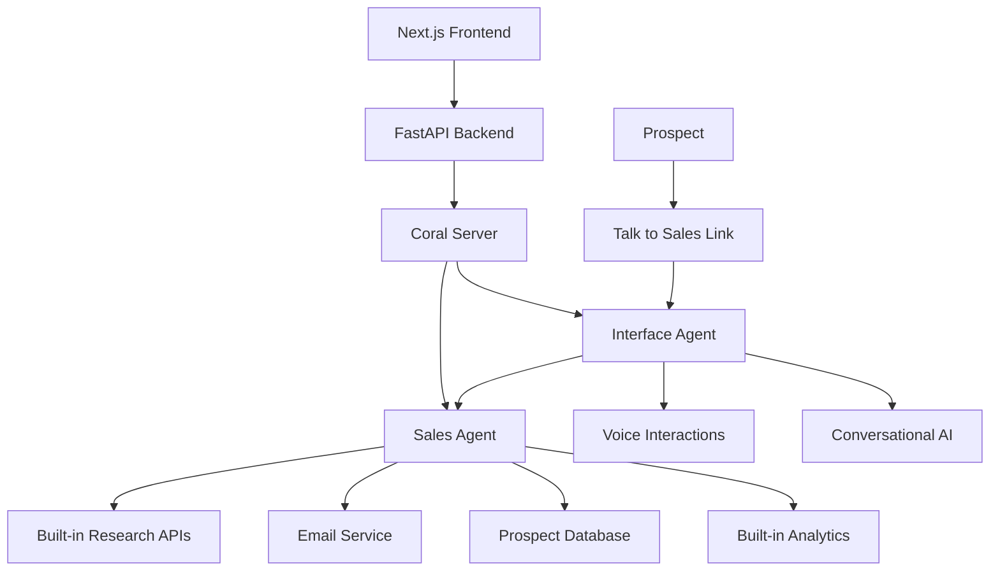
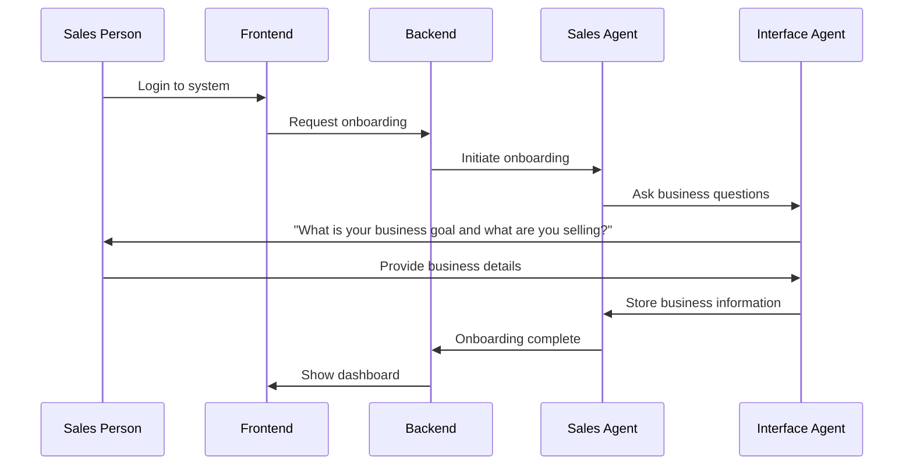
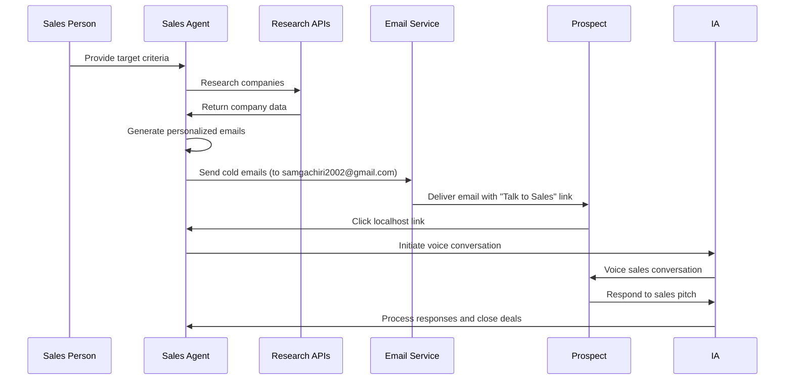
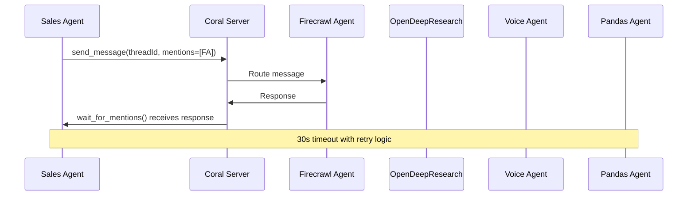
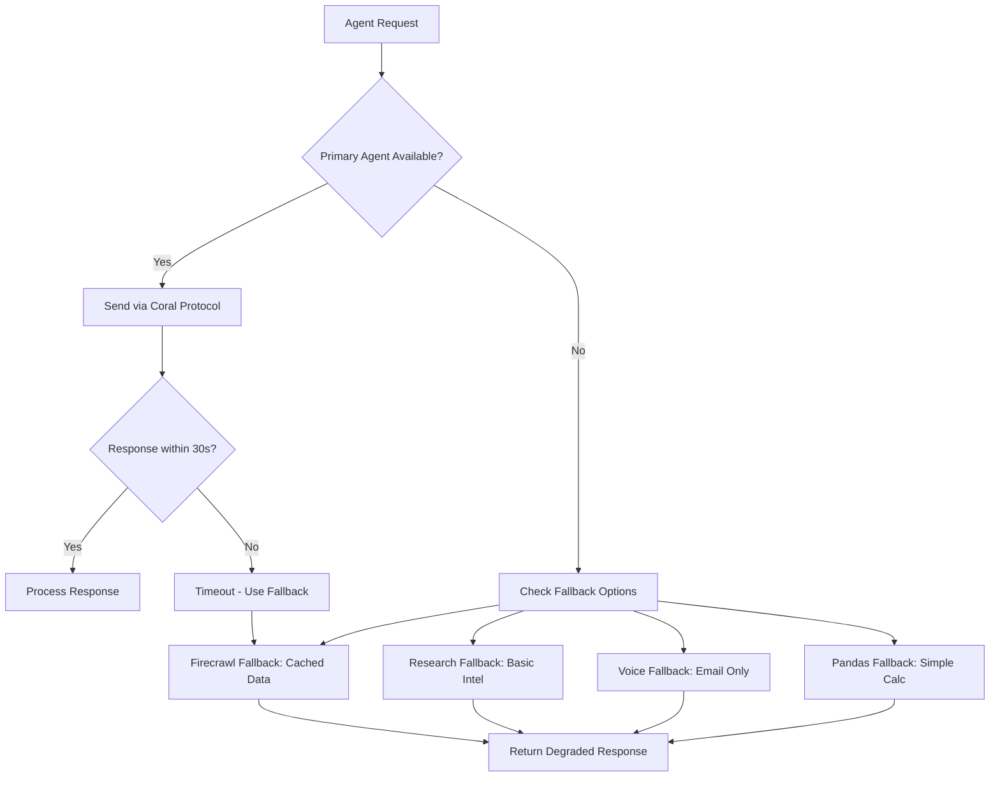
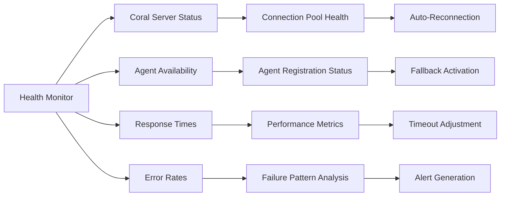

# Design Document

## Overview

The Digital Sales Agent Webapp is a streamlined sales automation system built on the Coral Protocol using a two-agent architecture: a Sales Agent that handles all sales operations and an Interface Agent that manages conversational interactions. The system eliminates complex multi-agent communication issues by consolidating functionality into the Sales Agent while leveraging the Interface Agent for voice interactions and user communication.

The architecture follows the proven pattern established by the winning Prosus restaurant webapp, adapting it for sales automation with a focus on production-ready functionality and reliable communication patterns.

## Architecture

### High-Level Architecture



### Agent Communication Flow

#### Initial Onboarding Flow



#### Sales Process Flow



## Components and Interfaces

### 1. Sales Agent (Primary Worker)

**Purpose:** Main sales automation engine that handles all sales operations including research, email generation, prospect management, and deal closing coordination.

**Key Responsibilities:**

- Business information collection and storage
- Prospect research using built-in APIs
- Personalized cold email generation and sending
- Prospect database management
- Deal closing coordination via Interface Agent
- Sales analytics and reporting

**Interface:**

```python
class SalesAgent:
    async def collect_business_info(self, interface_agent_id: str)
    async def research_prospects(self, target_criteria: dict) -> List[Prospect]
    async def generate_cold_emails(self, prospects: List[Prospect]) -> List[Email]
    async def send_emails(self, emails: List[Email], test_email: str = "samgachiri2002@gmail.com")
    async def initiate_sales_conversation(self, prospect_id: str, interface_agent_id: str)
    async def close_deal(self, conversation_data: dict) -> DealResult
    async def generate_analytics(self) -> AnalyticsReport
```

### 2. Interface Agent (Conversational Interface)

**Purpose:** Handles all conversational interactions including voice onboarding, prospect conversations, and deal closing discussions.

**Key Responsibilities:**

- Voice-based business information collection
- Sales conversation management with prospects
- Deal closing conversations
- Fallback to text-based interactions when voice fails

**Interface:**

```python
class InterfaceAgent:
    async def conduct_onboarding(self, sales_person_id: str) -> BusinessInfo
    async def ask_business_questions(self) -> str
    async def process_business_response(self, response: str) -> BusinessInfo
    async def initiate_sales_conversation(self, prospect_data: dict) -> ConversationSession
    async def conduct_sales_pitch(self, session_id: str, prospect_input: str) -> SalesResponse
    async def attempt_deal_closure(self, session_id: str) -> DealAttempt
```

### 3. Built-in Services (No External Agents)

#### Research Service

- **Purpose:** Company and prospect research
- **Implementation:** Direct API integrations (LinkedIn, Crunchbase, web scraping libraries)
- **Data Flow:** Company domains/names → Contact information, company intelligence
- **Fallback:** Cached data, manual entry options

#### Email Service

- **Purpose:** Cold email generation and delivery
- **Implementation:** SMTP integration with template engine
- **Data Flow:** Prospect data + business info → Personalized emails → Email delivery
- **Test Mode:** All emails sent to samgachiri2002@gmail.com

#### Analytics Service

- **Purpose:** Sales performance tracking and reporting
- **Implementation:** Built-in calculations and data aggregation
- **Data Flow:** Sales activities → Metrics calculation → Dashboard updates
- **Fallback:** Cached reports, simplified calculations

#### Voice Service (via Interface Agent)

- **Purpose:** Voice interactions for onboarding and sales conversations
- **Implementation:** Interface Agent with voice capabilities
- **Data Flow:** Voice input → Text processing → Voice response
- **Fallback:** Text-based chat interface

### 4. Frontend Application (Next.js)

**Components:**

- Onboarding interface for business information collection
- Dashboard for pipeline overview
- Prospect discovery interface
- Email campaign management
- Sales conversation interface (for "Talk to Sales" links)
- Analytics and reporting

**Key Pages:**

```
/onboarding - Voice-based business information collection
/dashboard - Main sales pipeline view
/discover - Prospect discovery and research
/emails - Cold email campaigns and templates
/conversations - Sales conversation interface (localhost endpoint)
/analytics - Performance metrics and reports
/settings - System configuration
```

## Data Models

### Business Info Model

```typescript
interface BusinessInfo {
  id: string;
  salesPersonId: string;
  businessGoal: string;
  productDescription: string;
  targetMarket: string;
  valueProposition: string;
  pricingModel?: string;
  createdAt: Date;
  updatedAt: Date;
}
```

### Prospect Model

```typescript
interface Prospect {
  id: string;
  companyName: string;
  domain: string;
  industry: string;
  contacts: Contact[];
  researchData: ResearchData;
  emailsSent: Email[];
  conversationSessions: ConversationSession[];
  dealStatus: DealStatus;
  createdAt: Date;
  updatedAt: Date;
}
```

### Contact Model

```typescript
interface Contact {
  id: string;
  name: string;
  email: string;
  phone?: string;
  title: string;
  department: string;
  decisionMaker: boolean;
  linkedinUrl?: string;
}
```

### Email Model

```typescript
interface Email {
  id: string;
  prospectId: string;
  contactId: string;
  subject: string;
  content: string;
  talkToSalesLink: string;
  sentTo: string; // Always samgachiri2002@gmail.com for testing
  sentAt: Date;
  opened?: boolean;
  clicked?: boolean;
}
```

### Conversation Session Model

```typescript
interface ConversationSession {
  id: string;
  prospectId: string;
  startedAt: Date;
  endedAt?: Date;
  messages: ConversationMessage[];
  dealAttempts: DealAttempt[];
  status: "active" | "completed" | "abandoned";
}
```

### Deal Status Model

```typescript
interface DealStatus {
  stage:
    | "prospect"
    | "contacted"
    | "conversation"
    | "negotiation"
    | "closed"
    | "lost";
  value?: number;
  closedAt?: Date;
  notes: string[];
}
```

## Error Handling and Fallback Architecture

### Agent Communication Reliability

#### Primary Communication Pattern



#### Fallback Communication Pattern



### Fallback Mechanisms by Agent

#### Firecrawl Agent Fallbacks

1. **Primary:** Coral Protocol → Firecrawl Agent
2. **Fallback 1:** Direct HTTP calls to backup scraping service
3. **Fallback 2:** Cached company data from previous scrapes
4. **Fallback 3:** Manual data entry prompts with company database lookup

#### OpenDeepResearch Agent Fallbacks

1. **Primary:** Coral Protocol → OpenDeepResearch Agent
2. **Fallback 1:** Direct API calls to research databases (Crunchbase, LinkedIn)
3. **Fallback 2:** Basic company intelligence from cached sources
4. **Fallback 3:** Simplified research using company domain analysis

#### VoiceInterface Agent Fallbacks

1. **Primary:** Coral Protocol → VoiceInterface Agent → ElevenLabs
2. **Fallback 1:** Direct ElevenLabs API integration
3. **Fallback 2:** Email-only communication with voice script templates
4. **Fallback 3:** Text-based interaction logging for manual follow-up

#### Pandas Agent Fallbacks

1. **Primary:** Coral Protocol → Pandas Agent
2. **Fallback 1:** Local analytics calculations using simplified algorithms
3. **Fallback 2:** Cached analytics reports with timestamp indicators
4. **Fallback 3:** Basic metrics calculation without advanced analysis

### Communication Timeout Strategy

```python
# Timeout Configuration
AGENT_TIMEOUTS = {
    "firecrawl": 45,      # Web scraping can be slow
    "research": 60,       # Research queries take time
    "voice": 30,          # Voice interactions should be quick
    "pandas": 20,         # Data analysis should be fast
    "default": 30
}

# Retry Logic
MAX_RETRIES = 3
RETRY_DELAY = 5  # seconds between retries
```

### Agent Health Monitoring



### Error Handling Implementation

#### Agent Communication Errors

- **Connection Failures:** Auto-retry with exponential backoff
- **Timeout Handling:** 30-second timeouts with retry logic (3 attempts)
- **Agent Unavailability:** Immediate fallback to alternative methods
- **Data Validation:** Schema validation for all agent responses with error correction

#### User Experience Errors

- **Network Issues:** Offline mode with local caching and sync on reconnection
- **Invalid Inputs:** Real-time validation with helpful error messages and suggestions
- **Processing Delays:** Progress indicators with estimated completion times and cancel options

#### Data Integrity

- **Duplicate Detection:** Prevent duplicate prospect entries using domain + company name hashing
- **Consistency Checks:** Validate data across agent responses with conflict resolution
- **Audit Trails:** Log all agent interactions and data changes with rollback capabilities

### Graceful Degradation Levels

#### Level 1: Full Functionality

- All agents operational via Coral Protocol
- Real-time voice interactions
- Complete analytics and research

#### Level 2: Partial Functionality

- Some agents using fallback methods
- Email-only communication
- Cached analytics with warnings

#### Level 3: Basic Functionality

- Manual data entry options
- Simple lead scoring
- Basic pipeline tracking

#### Level 4: Emergency Mode

- Read-only access to existing data
- Manual process documentation
- System recovery procedures

## Testing Strategy

### Unit Testing

- **Agent Functions:** Test individual agent tool functions
- **Data Models:** Validate data transformation and validation
- **API Endpoints:** Test all REST API endpoints

### Integration Testing

- **Agent Communication:** Test Coral Protocol message passing
- **Workflow Testing:** End-to-end sales process validation
- **External APIs:** Mock external service integrations

### Performance Testing

- **Load Testing:** Simulate multiple concurrent sales processes
- **Agent Scalability:** Test agent performance under load
- **Response Times:** Ensure sub-second response times for UI interactions

### User Acceptance Testing

- **Sales Workflow:** Test complete prospect-to-deal workflows
- **Voice Interactions:** Test ElevenLabs voice quality and accuracy
- **Analytics Accuracy:** Validate reporting and metrics calculations

## Security and Compliance

### Data Protection

- **GDPR Compliance:** Implement consent management and data deletion
- **Data Encryption:** Encrypt sensitive prospect and contact data
- **Access Controls:** Role-based access to prospect information

### Voice Recording Compliance

- **Consent Management:** Explicit consent for voice recordings
- **Recording Disclosure:** Clear notification of recording activities
- **Data Retention:** Configurable retention policies for voice data

### API Security

- **Authentication:** JWT-based authentication for all endpoints
- **Rate Limiting:** Prevent abuse of prospect discovery features
- **Input Validation:** Sanitize all user inputs and agent responses

## Deployment Architecture

### Development Environment

- **Local Coral Server:** Single-node development setup
- **Agent Containers:** Docker containers for each agent
- **Database:** PostgreSQL for prospect and interaction data
- **Frontend:** Next.js development server

### Production Environment

- **Coral Server Cluster:** Multi-node setup for high availability
- **Agent Scaling:** Kubernetes deployment for agent scaling
- **Database:** Managed PostgreSQL with read replicas
- **CDN:** CloudFront for static asset delivery
- **Monitoring:** Comprehensive logging and metrics collection

## Technology Stack

### Backend

- **Coral Protocol:** Agent orchestration and communication
- **FastAPI:** REST API and WebSocket endpoints
- **LangChain:** Agent framework and LLM integration
- **PostgreSQL:** Primary data storage
- **Redis:** Caching and session management

### Frontend

- **Next.js 14:** React framework with App Router
- **TypeScript:** Type-safe development
- **Tailwind CSS:** Utility-first styling
- **LiveKit:** Real-time voice communication
- **Framer Motion:** Animations and transitions

### External Services

- **ElevenLabs:** Text-to-speech for voice interactions
- **Firecrawl:** Web scraping and data extraction
- **OpenAI/Groq:** LLM providers for agent intelligence
- **Linkup:** Research data and company intelligence

## Performance Considerations

### Agent Optimization

- **Parallel Processing:** Execute independent agent tasks concurrently
- **Caching Strategy:** Cache research data and company information
- **Connection Pooling:** Efficient Coral Protocol connection management

### Database Optimization

- **Indexing Strategy:** Optimize queries for prospect search and filtering
- **Data Partitioning:** Partition large datasets by date or company size
- **Query Optimization:** Use materialized views for analytics

### Frontend Performance

- **Code Splitting:** Lazy load components and routes
- **Image Optimization:** Optimize images and assets
- **Caching:** Implement service worker for offline functionality
