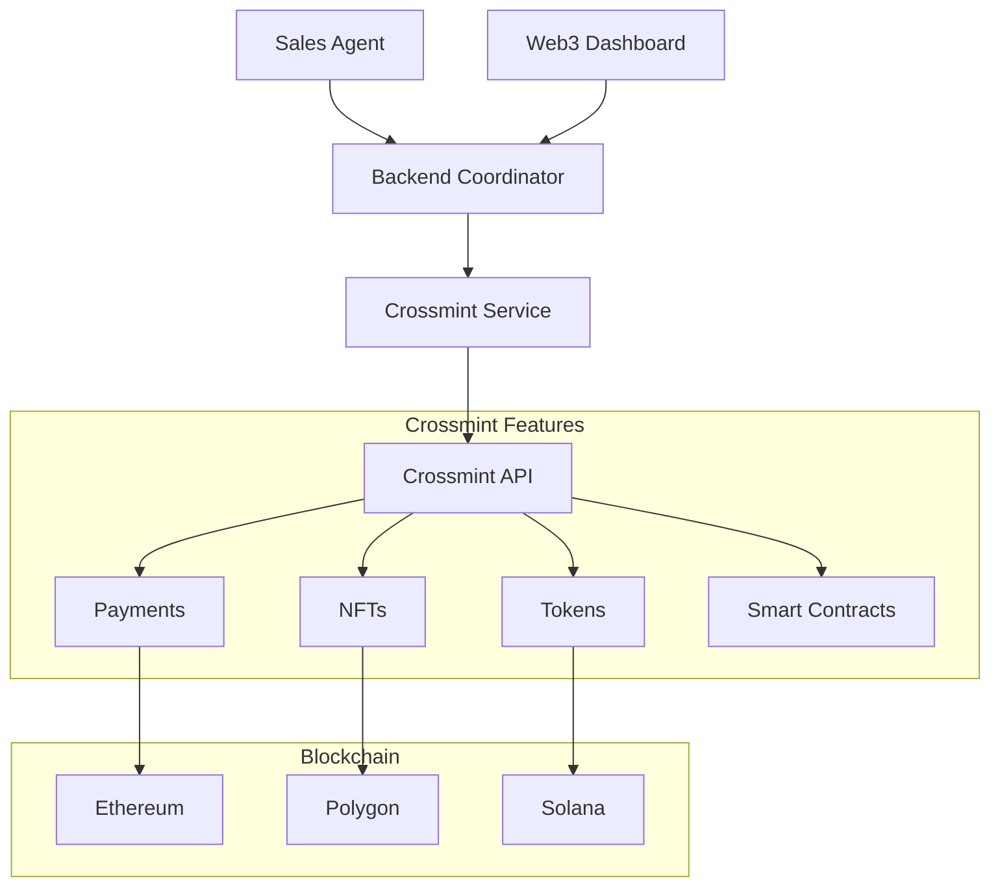

# Crossmint Web3 Integration Guide

## Overview

The Digital Sales Agent integrates with [Crossmint](https://crossmint.com) to provide blockchain-powered features including subscription payments, NFT achievement rewards, and automated commission distribution. This integration demonstrates how traditional sales automation can be enhanced with Web3 technologies.

## 🎯 Use Cases

### 1. **Subscription Payments**

- Accept payments for sales automation services
- Automatic fiat-to-crypto conversion
- Global payment acceptance without traditional banking limitations
- Lower transaction fees compared to traditional processors

### 2. **NFT Achievement Rewards**

- Mint blockchain-verified achievement NFTs for sales performance
- Gamify the sales process with collectible rewards
- Create verifiable credentials for sales achievements
- Build a reputation system based on blockchain records

### 3. **Commission Token Distribution**

- Transparent commission tracking via blockchain tokens
- Automated distribution based on deal closure
- Cross-border commission payments without banking delays
- Programmable payout rules via smart contracts

### 4. **Smart Contract Automation**

- Automated deal processing and escrow
- Trustless commission distribution
- Dispute resolution mechanisms
- Audit trail on blockchain

## 🚀 Quick Start

### 1. Get Crossmint API Keys

1. Sign up at [Crossmint Console](https://console.crossmint.com)
2. Create a new project
3. Get your API key and Project ID
4. Choose environment (staging for development, production for live)

### 2. Configure Environment Variables

Add to `backend/.env`:

```env
# Crossmint Configuration
CROSSMINT_API_KEY=your_crossmint_api_key
CROSSMINT_PROJECT_ID=your_crossmint_project_id
CROSSMINT_ENVIRONMENT=staging
```

Add to `SalesUI/.env.local`:

```env
# Crossmint Frontend Configuration
NEXT_PUBLIC_CROSSMINT_PROJECT_ID=your_crossmint_project_id
NEXT_PUBLIC_CROSSMINT_ENVIRONMENT=staging
```

### 3. Test the Integration

```bash
# Run the demo script
python demo_crossmint_integration.py

# Or access the Web3 dashboard
# Start the application and visit: http://localhost:3000/web3
```

## 📋 API Endpoints

### Subscription Payments

```bash
POST /api/crossmint/subscription
Content-Type: application/json

{
  "customer_email": "customer@example.com",
  "customer_name": "John Doe",
  "plan_type": "pro",
  "amount": 99.00
}
```

### Achievement NFTs

```bash
POST /api/crossmint/achievement
Content-Type: application/json

{
  "recipient_email": "agent@example.com",
  "achievement_type": "top_performer",
  "performance_data": {
    "performance_percentage": 150,
    "deals_closed": 10,
    "revenue": 50000,
    "conversion_rate": 85
  }
}
```

### Deal Processing

```bash
POST /api/crossmint/deal-payment
Content-Type: application/json

{
  "deal_id": "deal_12345",
  "amount": 5000,
  "customer_email": "customer@example.com",
  "sales_agent_id": "sales_agent_001"
}
```

### Wallet Status

```bash
GET /api/crossmint/wallet/{email}
```

## 🎮 Web3 Dashboard Features

Access the Web3 dashboard at `http://localhost:3000/web3` to:

- **View Wallet Status**: See NFT count, commission tokens, and total earnings
- **Create Payments**: Test subscription payment processing
- **Mint Achievements**: Create NFT rewards for performance milestones
- **Process Deals**: Simulate automated deal processing with rewards
- **Explore Features**: Learn about Web3 capabilities

## 🔧 Integration Architecture



## 💡 Implementation Details

### Automatic Rewards on Deal Closure

When a deal is closed through the Sales Agent:

1. **Deal Processing**: Sales Agent detects deal closure
2. **Payment Creation**: Crossmint processes customer payment
3. **Commission Distribution**: 15% commission automatically distributed as tokens
4. **Achievement NFT**: "Deal Closer" NFT minted for the sales agent
5. **Audit Trail**: All transactions recorded on blockchain

### Achievement Types

- **Top Performer**: Exceeding sales targets
- **Deal Closer**: Successfully closing deals
- **Email Master**: High email campaign performance

### Commission Structure

- **Rate**: 15% of deal value
- **Token**: Sales Commission Token (SCT)
- **Distribution**: Automatic via smart contract
- **Minimum**: $100 threshold for payout

## 🔐 Security & Compliance

### Built-in Security

- **KYC/AML**: Crossmint handles compliance automatically
- **Fraud Protection**: Built-in fraud detection and prevention
- **Secure Wallets**: Enterprise-grade wallet infrastructure
- **Audit Trail**: Immutable blockchain transaction records

### Data Privacy

- **Email-based Wallets**: No need for users to manage private keys
- **GDPR Compliant**: Crossmint handles data protection requirements
- **Minimal Data**: Only necessary information stored on-chain

## 🌍 Multi-Chain Support

Crossmint supports multiple blockchains:

- **Ethereum**: Main network for high-value transactions
- **Polygon**: Low-cost transactions for frequent operations
- **Solana**: Fast transactions for real-time rewards
- **Base**: Coinbase's L2 for mainstream adoption

## 📊 Analytics & Reporting

Track Web3 metrics:

- **Payment Volume**: Total payments processed
- **NFT Distribution**: Achievement NFTs minted
- **Commission Tokens**: Total tokens distributed
- **Conversion Rates**: Fiat-to-crypto conversion metrics
- **User Adoption**: Web3 feature usage statistics

## 🚨 Troubleshooting

### Common Issues

**"Crossmint not configured"**

- Add API keys to environment variables
- Verify project ID is correct
- Check environment setting (staging/production)

**"Payment creation failed"**

- Verify API key has payment permissions
- Check amount and currency format
- Ensure customer email is valid

**"NFT minting failed"**

- Verify project has NFT collection set up
- Check recipient email format
- Ensure metadata is properly formatted

### Demo Mode

Without Crossmint configuration, the system runs in demo mode:

- All API calls return mock success responses
- No actual blockchain transactions occur
- Perfect for development and testing

## 🔮 Future Enhancements

### Planned Features

- **DAO Governance**: Community voting on sales strategies
- **Staking Rewards**: Stake commission tokens for additional rewards
- **Cross-Chain Bridges**: Move tokens between different blockchains
- **DeFi Integration**: Yield farming with commission tokens
- **Marketplace**: Trade achievement NFTs with other sales agents

### Advanced Use Cases

- **Referral Programs**: Tokenized referral rewards
- **Performance Bonds**: Stake tokens for guaranteed performance
- **Revenue Sharing**: Automatic revenue distribution to stakeholders
- **Loyalty Programs**: Long-term customer rewards via NFTs

## 📚 Resources

- **[Crossmint Documentation](https://docs.crossmint.com)**: Official API documentation
- **[Crossmint Console](https://console.crossmint.com)**: Project management dashboard
- **[Web3 Dashboard](http://localhost:3000/web3)**: Local integration interface
- **[Demo Script](./demo_crossmint_integration.py)**: Test all features

## 🤝 Support

For Crossmint-specific issues:

- **[Crossmint Discord](https://discord.gg/crossmint)**: Community support
- **[Support Email](mailto:support@crossmint.com)**: Direct support

For integration issues:

- **GitHub Issues**: Report bugs or request features
- **Demo Script**: Use for testing and validation

---

**Built with ❤️ for the Internet of Agents Hackathon**

_Demonstrating the future of sales automation with Web3 integration_
