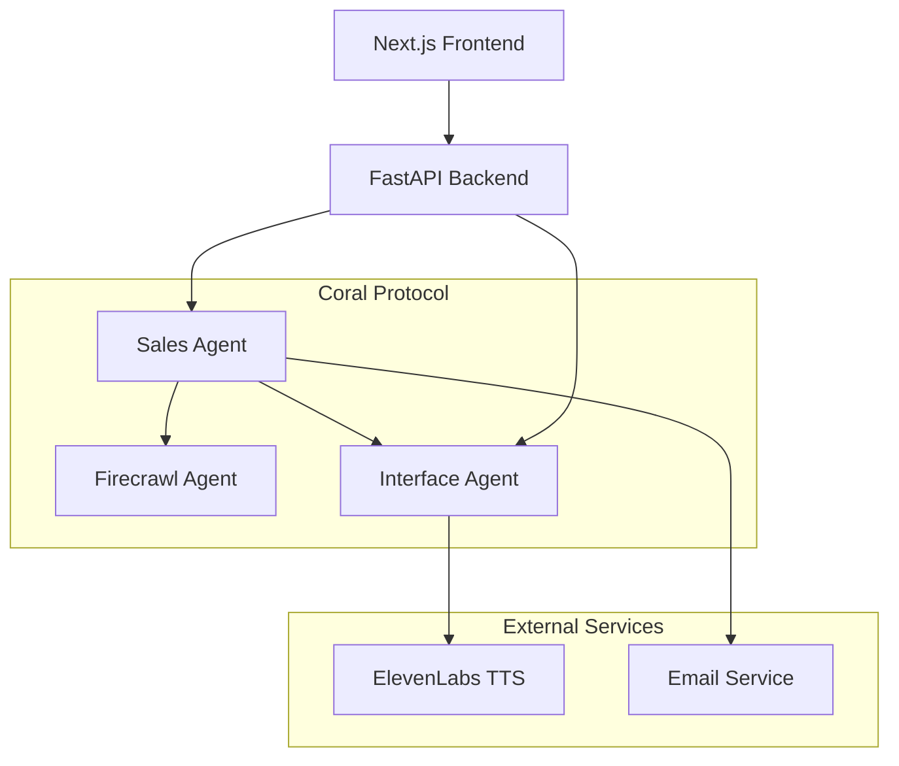

# Digital Sales Agent - AI-Powered Sales Automation

An intelligent sales automation system that leverages the Coral Protocol to orchestrate multiple specialized agents for complete sales workflows. Features ElevenLabs voice integration, automated prospect research, and real-time agent coordination.


## 🎯 Overview

The Digital Sales Agent automates the entire sales process from onboarding to deal closure using a sophisticated multi-agent architecture:

- **Voice-Powered Onboarding** - ElevenLabs TTS for natural business information collection
- **Automated Prospect Research** - AI agents coordinate to find and qualify leads
- **Intelligent Email Generation** - Personalized cold emails with conversation links
- **Real-Time Sales Conversations** - Voice-enabled prospect interactions
- **Complete Workflow Automation** - End-to-end sales process with minimal human intervention

## 🏗️ System Architecture

### Multi-Agent Ecosystem



**Core Agents:**

- **Sales Agent** - Central orchestrator handling prospect research, email generation, and workflow coordination
- **Interface Agent** - Voice-enabled agent for onboarding and sales conversations using ElevenLabs
- **Firecrawl Agent** - Web scraping specialist for prospect research and contact extraction
- **Backend Coordinator** - FastAPI service managing frontend requests and agent communication

**Technology Stack:**

- **Backend**: Python, FastAPI, LangChain, Coral Protocol
- **Frontend**: Next.js 14, TypeScript, Tailwind CSS
- **Voice AI**: ElevenLabs TTS for natural speech synthesis
- **Agent Communication**: Coral Protocol for multi-agent coordination
- **Data Models**: Pydantic for type-safe data handling

## 🚀 Quick Start & Setup

### Prerequisites

- **Python 3.13+** with `uv` package manager
- **Node.js 18+** with npm
- **API Keys**: OpenAI, ElevenLabs (for voice), Firecrawl (optional)
- **Email Setup**: SMTP credentials for email sending (Gmail recommended)

### 1. Clone and Setup

```bash
git clone <repository-url>
cd Coral-LeadsWebapp
```

### 2. Start Coral Server

```bash
cd coral-server
./gradlew run
# Server will start on http://localhost:5555
```

### 3. Configure Environment Variables

#### Sales Agent Configuration

```bash
cd Coral-Sales-Agent
cp .env_sample .env
```

Edit `.env` with your credentials:

```env
# Model Configuration
MODEL_NAME=gpt-4o-mini
MODEL_PROVIDER=openai
MODEL_API_KEY=your_openai_api_key_here

# Coral Protocol
CORAL_SSE_URL=http://localhost:5555/sse/v1/devmode/exampleApplication/privkey/session1/sse
CORAL_AGENT_ID=sales_agent

# Email Configuration (Optional - for real email sending)
SMTP_SERVER=smtp.gmail.com
SMTP_PORT=587
SMTP_USERNAME=your_email@gmail.com
SMTP_PASSWORD=your_app_password
TEST_EMAIL=samgachiri2002@gmail.com
```

#### Backend Configuration

```bash
cd backend
cp .env.example .env
```

Edit `backend/.env`:

```env
# Model Configuration
MODEL_NAME=gpt-4o-mini
MODEL_PROVIDER=openai
MODEL_API_KEY=your_openai_api_key_here

# ElevenLabs Configuration
ELEVENLABS_API_KEY=your_elevenlabs_api_key
ELEVENLABS_VOICE_ID=your_voice_id

# Coral Protocol
CORAL_SSE_URL=http://localhost:5555
CORAL_AGENT_ID=backend_coordinator
```

#### Frontend Configuration

```bash
cd SalesUI
cp .env.local.example .env.local
```

Edit `SalesUI/.env.local`:

```env
NEXT_PUBLIC_BACKEND_URL=http://localhost:8000
ELEVENLABS_API_KEY=your_elevenlabs_api_key
ELEVENLABS_VOICE_ID=your_voice_id
```

### 4. Start All Services

Use the provided batch script (Windows) or start manually:

```bash
# Windows
start_agents.bat

# Manual startup (run each in separate terminals)
cd coral-server && ./gradlew run
cd Coral-Sales-Agent && uv run python main.py
cd Coral-FirecrawlMCP-Agent && uv run python main.py
cd Coral-Interface-Agent && uv run python main.py
cd backend && python main.py
cd SalesUI && npm run dev
```

### 5. Access the Application

- **Frontend**: http://localhost:3000
- **Backend API**: http://localhost:8000
- **Coral Server**: http://localhost:5555
- **API Health Check**: http://localhost:8000/api/health

### Email Setup (Optional)

For real email sending, configure Gmail App Password:

1. Enable 2-Factor Authentication on your Gmail account
2. Generate an App Password: Google Account → Security → App passwords
3. Use the App Password in `SMTP_PASSWORD` (not your regular password)
4. Set `SMTP_USERNAME` to your Gmail address

**Note**: Without SMTP configuration, the system works in demo mode sending emails to `samgachiri2002@gmail.com` for testing.

## 📋 Features

### ✅ Implemented

- [x] Sales Agent with Coral Protocol integration
- [x] Sales Interface Agent with FastAPI endpoints
- [x] Next.js frontend with dashboard and discovery pages
- [x] TypeScript data models and interfaces
- [x] Integration with existing Coral agents
- [x] Responsive UI with Tailwind CSS
- [x] Real-time agent status monitoring

### 🚧 In Progress

- [ ] Voice interaction integration with ElevenLabs
- [ ] BANT lead scoring algorithms
- [ ] Email template generation
- [ ] Analytics dashboard with charts
- [ ] CRM integration capabilities

### 📅 Planned

- [ ] Database persistence with PostgreSQL
- [ ] WebSocket real-time updates
- [ ] Advanced analytics and reporting
- [ ] Docker containerization
- [ ] Kubernetes deployment manifests

## 🎮 Usage Examples

### Discover Prospects

```bash
curl -X POST http://localhost:8000/sales/discover-prospects \
  -H "Content-Type: application/json" \
  -d '{
    "industry": "technology",
    "company_size": "50-200",
    "keywords": ["SaaS", "startup"]
  }'
```

### Qualify a Lead

```bash
curl -X POST http://localhost:8000/sales/qualify-lead \
  -H "Content-Type: application/json" \
  -d '{
    "prospect_id": "123",
    "contact_id": "456"
  }'
```

### Initiate Contact

```bash
curl -X POST http://localhost:8000/sales/initiate-contact \
  -H "Content-Type: application/json" \
  -d '{
    "prospect_id": "123",
    "contact_id": "456",
    "method": "voice",
    "message": "Hi, I'd like to discuss how we can help your business grow"
  }'
```

## 🏆 Hackathon Features

This project demonstrates several key hackathon themes:

### Coral Protocol (Mandatory) ✅

- Multi-agent orchestration and communication
- Reuse of existing agents from the Coral ecosystem
- Zero-trust API coordination between specialized agents

### ElevenLabs Integration 🎤

- Voice-based prospect outreach and qualification
- Real-time conversation capabilities
- Natural, expressive voice interactions

### Agent Reusability 🔄

- Leverages 4 existing Coral Protocol agents
- Demonstrates the power of composable AI systems
- Shows how agents can be combined for new use cases

## 📁 Project Structure

```
Coral-LeadsWebapp/
├── Coral-SalesAgent/              # Main sales orchestrator
│   ├── main.py
│   ├── models.py
│   ├── pyproject.toml
│   └── README.md
├── Coral-SalesInterfaceAgent/     # FastAPI backend
│   ├── main.py
│   ├── pyproject.toml
│   └── .env_sample
├── SalesUI/                       # Next.js frontend
│   ├── app/
│   ├── components/
│   ├── package.json
│   └── tailwind.config.js
├── types/                         # Shared TypeScript types
│   └── index.ts
└── README.md
```

## 🤝 Contributing

1. Fork the repository
2. Create a feature branch (`git checkout -b feature/amazing-feature`)
3. Commit your changes (`git commit -m 'Add amazing feature'`)
4. Push to the branch (`git push origin feature/amazing-feature`)
5. Open a Pull Request

## 📄 License

This project is licensed under the MIT License - see the [LICENSE](LICENSE) file for details.

## 🙏 Acknowledgments

- [Coral Protocol](https://coralprotocol.org) for the agent orchestration framework
- [ElevenLabs](https://elevenlabs.io) for voice AI capabilities
- [Firecrawl](https://firecrawl.dev) for web scraping capabilities
- [OpenDeepResearch](https://github.com/langchain-ai/open_deep_research) for research automation

## 📞 Support

- [Discord](https://discord.com/invite/Xjm892dtt3) - Join the Coral Protocol community
- [GitHub Issues](https://github.com/your-repo/issues) - Report bugs or request features
- [Documentation](https://coralprotocol.org/docs) - Coral Protocol documentation

---

Built with ❤️ for the Internet of Agents Hackathon
