# Digital Sales Agent - AI-Powered Sales Automation

An intelligent sales automation system that leverages the Coral Protocol to orchestrate multiple specialized agents for complete sales workflows. Features ElevenLabs voice integration, automated prospect research, real-time agent coordination, and blockchain payment integration via Crossmint.


## 🎯 Overview

The Digital Sales Agent automates the entire sales process from onboarding to deal closure using a sophisticated multi-agent architecture:

- **Voice-Powered Onboarding** - ElevenLabs TTS for natural business information collection
- **Automated Prospect Research** - AI agents coordinate to find and qualify leads
- **Intelligent Email Generation** - Personalized cold emails with conversation links
- **Real-Time Sales Conversations** - Voice-enabled prospect interactions
- **Blockchain Payment Integration** - Crossmint for seamless crypto and fiat payments
- **Complete Workflow Automation** - End-to-end sales process with minimal human intervention

## 🏗️ System Architecture

### Multi-Agent Ecosystem

```mermaid
graph TB
    UI[🖥️ Next.js Frontend] --> Backend[⚡ FastAPI Backend]

    Backend --> Sales[🤖 Sales Agent]
    Sales --> Firecrawl[🌐 Firecrawl Agent]
    Sales --> Interface[🔌 Interface Agent]
    Backend --> Interface

    subgraph Coral["🌊 Coral Protocol"]
        Sales
        Firecrawl
        Interface
    end

    subgraph External["☁️ External Services"]
        ElevenLabs[🎙️ ElevenLabs TTS]
        SMTP[📧 Email Service]
        Crossmint[💳 Crossmint Payments]
    end

    Interface --> ElevenLabs
    Sales --> SMTP
    Sales --> Crossmint
```


**Core Agents:**

- **Sales Agent** - Central orchestrator handling prospect research, email generation, and workflow coordination
- **Interface Agent** - Voice-enabled agent for onboarding and sales conversations using ElevenLabs
- **Firecrawl Agent** - Web scraping specialist for prospect research and contact extraction
- **Backend Coordinator** - FastAPI service managing frontend requests and agent communication

**Technology Stack:**

- **Backend**: Python, FastAPI, LangChain, Coral Protocol
- **Frontend**: Next.js 14, TypeScript, Tailwind CSS
- **Voice AI**: ElevenLabs TTS for natural speech synthesis
- **Agent Communication**: Coral Protocol for multi-agent coordination
- **Data Models**: Pydantic for type-safe data handling

## 🚀 Quick Start & Setup

### Prerequisites

- **Python 3.13+** with `uv` package manager
- **Node.js 18+** with npm
- **API Keys**: OpenAI, ElevenLabs (for voice), Firecrawl (optional), Crossmint (for payments)
- **Email Setup**: SMTP credentials for email sending (Gmail recommended)

### 1. Clone and Setup

```bash
git clone https://github.com/samwel-gachiri/digital-sales-agent.git
cd digital-sales-agent
```

### 2. Start Coral Server

```bash
cd coral-server
./gradlew run
# Server will start on http://localhost:5555
```

### 3. Install Dependencies

```bash
# Install Python dependencies for all agents
cd Coral-Sales-Agent && uv sync
cd ../Coral-Interface-Agent && uv sync
cd ../Coral-FirecrawlMCP-Agent && uv sync
cd ../backend && pip install -r requirements.txt

# Install Node.js dependencies
cd ../SalesUI && npm install
```

### 4. Configure Environment Variables

#### Sales Agent Configuration

```bash
cd Coral-Sales-Agent
cp .env_sample .env
```

Edit `.env` with your credentials:

```env
# Model Configuration
MODEL_NAME=gpt-4o-mini
MODEL_PROVIDER=openai
MODEL_API_KEY=your_openai_api_key_here
MODEL_TEMPERATURE=0.1
MODEL_MAX_TOKENS=8000

# Coral Protocol
CORAL_SSE_URL=http://localhost:5555/sse/v1/devmode/exampleApplication/privkey/session1/sse
CORAL_AGENT_ID=sales_agent
TIMEOUT_MS=60

# Email Configuration (Optional - for real email sending)
SMTP_SERVER=smtp.gmail.com
SMTP_PORT=587
SMTP_USERNAME=your_email@gmail.com
SMTP_PASSWORD=your_16_character_app_password
TEST_EMAIL=samgachiri2002@gmail.com
```

#### Backend Configuration

```bash
cd backend
cp .env.example .env
```

Edit `backend/.env`:

```env
# Model Configuration
MODEL_NAME=gpt-4o-mini
MODEL_PROVIDER=openai
MODEL_API_KEY=your_openai_api_key_here
MODEL_TEMPERATURE=0.1
MODEL_MAX_TOKENS=8000

# ElevenLabs Configuration
ELEVENLABS_API_KEY=your_elevenlabs_api_key
ELEVENLABS_VOICE_ID=your_preferred_voice_id

# Coral Protocol
CORAL_SSE_URL=http://localhost:5555
CORAL_AGENT_ID=backend_coordinator

# Crossmint Configuration (Optional - for payment processing)
CROSSMINT_API_KEY=your_crossmint_api_key
CROSSMINT_PROJECT_ID=your_crossmint_project_id
CROSSMINT_ENVIRONMENT=staging
```

#### Interface Agent Configuration

```bash
cd Coral-Interface-Agent
cp .env_sample .env
```

Edit with your OpenAI credentials and Coral settings.

#### Firecrawl Agent Configuration

```bash
cd Coral-FirecrawlMCP-Agent
cp .env_sample .env
```

Edit with Firecrawl API key if you have one (optional for demo).

#### Frontend Configuration

```bash
cd SalesUI
cp .env.local.example .env.local
```

Edit `SalesUI/.env.local`:

```env
NEXT_PUBLIC_BACKEND_URL=http://localhost:8000
NEXT_PUBLIC_ELEVENLABS_API_KEY=your_elevenlabs_api_key
NEXT_PUBLIC_ELEVENLABS_VOICE_ID=your_voice_id
NEXT_PUBLIC_CROSSMINT_PROJECT_ID=your_crossmint_project_id
```

### 5. Start All Services

#### Option A: Use Batch Script (Windows)

```bash
start_agents.bat
```

#### Option B: Manual Startup (Cross-platform)

Run each command in a separate terminal:

```bash
# Terminal 1: Coral Server
cd coral-server && ./gradlew run

# Terminal 2: Sales Agent
cd Coral-Sales-Agent && uv run python main.py

# Terminal 3: Interface Agent
cd Coral-Interface-Agent && uv run python main.py

# Terminal 4: Firecrawl Agent
cd Coral-FirecrawlMCP-Agent && uv run python main.py

# Terminal 5: Backend API
cd backend && python main.py

# Terminal 6: Frontend
cd SalesUI && npm run dev
```

### 6. Access the Application

- **Frontend**: http://localhost:3000
- **Backend API**: http://localhost:8000
- **API Documentation**: http://localhost:8000/docs
- **Coral Server**: http://localhost:5555
- **Health Check**: http://localhost:8000/api/health

### 7. Verify Setup

1. **Check Health**: Visit http://localhost:8000/api/health
2. **Test ElevenLabs**: POST to http://localhost:8000/api/test/elevenlabs
3. **Test Crossmint**: Run `python demo_crossmint_integration.py`
4. **Start Onboarding**: Go to http://localhost:3000/onboarding
5. **Explore Web3**: Visit http://localhost:3000/web3
6. **Monitor Logs**: Check all terminal windows for successful connections

## 📧 Email Setup Guide

### Gmail SMTP Configuration (Recommended)

1. **Enable 2-Factor Authentication** on your Gmail account
2. **Generate App Password**:

   - Go to [Google Account Security](https://myaccount.google.com/security)
   - Navigate to "2-Step Verification" → "App passwords"
   - Generate password for "Mail" application
   - Copy the 16-character password (no spaces)

3. **Update Environment Variables**:

```env
# In Coral-Sales-Agent/.env
SMTP_SERVER=smtp.gmail.com
SMTP_PORT=587
SMTP_USERNAME=your_email@gmail.com
SMTP_PASSWORD=your_16_character_app_password
TEST_EMAIL=samgachiri2002@gmail.com
```

### Alternative Email Providers

#### Outlook/Hotmail

```env
SMTP_SERVER=smtp-mail.outlook.com
SMTP_PORT=587
SMTP_USERNAME=your_email@outlook.com
SMTP_PASSWORD=your_password
```

#### Custom SMTP Server

```env
SMTP_SERVER=your_smtp_server.com
SMTP_PORT=587  # or 465 for SSL
SMTP_USERNAME=your_username
SMTP_PASSWORD=your_password
```

### Email Flow

1. **Onboarding** → Collects business information
2. **Auto Research** → Finds prospects (currently uses fallback data)
3. **Email Generation** → Creates personalized cold emails
4. **Email Sending** → Sends emails with "Talk to Sales" links
5. **Conversation** → Handles prospect responses via web interface

### Troubleshooting Email Issues

**"SMTP credentials not configured"**

- Verify `.env` file exists in `Coral-Sales-Agent/`
- Check `SMTP_USERNAME` and `SMTP_PASSWORD` are set

**"Authentication failed"**

- Use App Password, not regular Gmail password
- Ensure 2FA is enabled on Gmail
- Verify username is full email address

**"Connection refused"**

- Check `SMTP_SERVER` and `SMTP_PORT` values
- Try port 465 for SSL or 587 for TLS
- Verify firewall isn't blocking connections

**Email Limits**

- Gmail free: 500 emails/day
- Consider upgrading for higher volumes
- Monitor sending rates to avoid limits

## 📋 Features

### ✅ Implemented

- [x] Sales Agent with Coral Protocol integration
- [x] Sales Interface Agent with FastAPI endpoints
- [x] Next.js frontend with dashboard and discovery pages
- [x] TypeScript data models and interfaces
- [x] Integration with existing Coral agents
- [x] Responsive UI with Tailwind CSS
- [x] Real-time agent status monitoring

### 🚧 In Progress

- [ ] Voice interaction integration with ElevenLabs
- [ ] BANT lead scoring algorithms
- [ ] Email template generation
- [ ] Analytics dashboard with charts
- [ ] CRM integration capabilities

### 📅 Planned

- [ ] Database persistence with PostgreSQL
- [ ] WebSocket real-time updates
- [ ] Advanced analytics and reporting
- [ ] Docker containerization
- [ ] Kubernetes deployment manifests

## 🎮 Usage Examples

### Discover Prospects

```bash
curl -X POST http://localhost:8000/sales/discover-prospects \
  -H "Content-Type: application/json" \
  -d '{
    "industry": "technology",
    "company_size": "50-200",
    "keywords": ["SaaS", "startup"]
  }'
```

### Qualify a Lead

```bash
curl -X POST http://localhost:8000/sales/qualify-lead \
  -H "Content-Type: application/json" \
  -d '{
    "prospect_id": "123",
    "contact_id": "456"
  }'
```

### Initiate Contact

```bash
curl -X POST http://localhost:8000/sales/initiate-contact \
  -H "Content-Type: application/json" \
  -d '{
    "prospect_id": "123",
    "contact_id": "456",
    "method": "voice",
    "message": "Hi, I'd like to discuss how we can help your business grow"
  }'
```

## 💳 Crossmint Integration

### What is Crossmint?

[Crossmint](https://crossmint.com) is a Web3 infrastructure platform that enables seamless integration of blockchain payments, NFTs, and digital wallets into traditional applications. It abstracts away the complexity of blockchain interactions, allowing users to pay with credit cards, bank transfers, or crypto while developers handle everything through simple APIs.

### Key Crossmint Features

- **Fiat-to-Crypto Payments** - Accept credit card payments that automatically convert to cryptocurrency
- **Multi-Chain Support** - Ethereum, Polygon, Solana, and other major blockchains
- **NFT Minting & Management** - Create and manage NFT collections without blockchain expertise
- **Wallet Abstraction** - Users don't need crypto wallets to interact with Web3 features
- **Compliance & Security** - Built-in KYC/AML compliance and enterprise-grade security

### Integration Opportunities in Digital Sales Agent

#### 1. **Subscription & Payment Processing**

```typescript
// Example: Process subscription payments for sales automation services
const subscription = await crossmint.payments.create({
  amount: 99.0,
  currency: "USD",
  description: "Digital Sales Agent Pro - Monthly Subscription",
  customer: {
    email: prospect.email,
    name: prospect.name,
  },
  metadata: {
    service: "sales_automation",
    tier: "pro",
    prospect_id: prospect.id,
  },
});
```

#### 2. **Performance-Based NFT Rewards**

Create NFT rewards for successful sales milestones:

```typescript
// Mint achievement NFTs for sales performance
const salesAchievementNFT = await crossmint.nfts.mint({
  collection: "sales-achievements",
  recipient: salesAgent.walletAddress,
  metadata: {
    name: "Top Performer Q4 2024",
    description: "Achieved 150% of sales target",
    attributes: [
      { trait_type: "Performance", value: "150%" },
      { trait_type: "Quarter", value: "Q4 2024" },
      { trait_type: "Deals Closed", value: "47" },
    ],
  },
});
```

#### 3. **Tokenized Sales Commissions**

Implement blockchain-based commission tracking:

```typescript
// Create commission tokens for sales team
const commissionToken = await crossmint.tokens.create({
  name: "Sales Commission Token",
  symbol: "SCT",
  decimals: 18,
  initialSupply: 1000000,
  metadata: {
    description: "Tokenized sales commissions for transparent tracking",
  },
});
```

#### 4. **Smart Contract Automation**

Automate deal closure and payment distribution:

```typescript
// Deploy smart contract for automated deal processing
const dealContract = await crossmint.contracts.deploy({
  type: "sales_automation",
  parameters: {
    salesAgent: agentAddress,
    commissionRate: 0.15, // 15%
    autoPayoutThreshold: 1000, // $1000 minimum
    escrowPeriod: 30, // 30 days
  },
});
```

### Implementation Roadmap

#### Phase 1: Basic Payment Integration

- [ ] Subscription payments for premium features
- [ ] One-time payments for custom sales campaigns
- [ ] Automated billing for usage-based pricing

#### Phase 2: NFT Rewards System

- [ ] Achievement NFTs for sales milestones
- [ ] Collectible cards for top-performing prospects
- [ ] Exclusive access tokens for premium features

#### Phase 3: Advanced Web3 Features

- [ ] DAO governance for sales strategy decisions
- [ ] Tokenized referral programs
- [ ] Cross-chain payment processing

### Configuration

Add Crossmint credentials to your environment:

```env
# Backend .env
CROSSMINT_API_KEY=your_crossmint_api_key
CROSSMINT_PROJECT_ID=your_crossmint_project_id
CROSSMINT_ENVIRONMENT=staging  # or 'production'

# Frontend .env.local
NEXT_PUBLIC_CROSSMINT_PROJECT_ID=your_crossmint_project_id
NEXT_PUBLIC_CROSSMINT_ENVIRONMENT=staging
```

### Example Integration

```typescript
// components/PaymentModal.tsx
import { CrossmintPayButton } from "@crossmint/client-sdk-react-ui";

export function PaymentModal({ subscription }: { subscription: any }) {
  return (
    <CrossmintPayButton
      projectId={process.env.NEXT_PUBLIC_CROSSMINT_PROJECT_ID}
      mintConfig={{
        type: "erc-20",
        quantity: subscription.tokens,
        metadata: {
          name: "Sales Automation Subscription",
          description: `${subscription.tier} tier access`,
        },
      }}
      environment={process.env.NEXT_PUBLIC_CROSSMINT_ENVIRONMENT}
      onPaymentSuccess={(result) => {
        console.log("Payment successful:", result);
        // Activate subscription
      }}
    />
  );
}
```

### Benefits for Sales Automation

1. **Global Payments** - Accept payments from anywhere without traditional banking limitations
2. **Reduced Fees** - Lower transaction costs compared to traditional payment processors
3. **Instant Settlement** - Immediate payment confirmation and settlement
4. **Programmable Money** - Smart contracts for automated commission distribution
5. **Transparency** - Blockchain-based audit trail for all transactions
6. **Innovation** - Cutting-edge payment technology attracts tech-savvy prospects

## 🏆 Hackathon Features

This project demonstrates several key hackathon themes:

### Coral Protocol (Mandatory) ✅

- Multi-agent orchestration and communication
- Reuse of existing agents from the Coral ecosystem
- Zero-trust API coordination between specialized agents

### ElevenLabs Integration 🎤

- Voice-based prospect outreach and qualification
- Real-time conversation capabilities
- Natural, expressive voice interactions

### Crossmint Web3 Integration 💳

- Blockchain payment processing for subscriptions
- NFT rewards for sales achievements
- Smart contract automation for deal processing
- Fiat-to-crypto payment conversion

### Agent Reusability 🔄

- Leverages 4 existing Coral Protocol agents
- Demonstrates the power of composable AI systems
- Shows how agents can be combined for new use cases

## 📁 Project Structure

```
digital-sales-agent/
├── Coral-Sales-Agent/             # Main sales orchestrator
│   ├── main.py                    # Sales agent with Coral Protocol
│   ├── models.py                  # Data models and schemas
│   ├── pyproject.toml             # Python dependencies
│   ├── .env_sample                # Environment template
│   └── README.md
├── Coral-Interface-Agent/         # Voice interaction agent
│   ├── main.py                    # ElevenLabs integration
│   ├── pyproject.toml
│   └── .env_sample
├── Coral-FirecrawlMCP-Agent/      # Web scraping agent
│   ├── main.py                    # Prospect research
│   ├── pyproject.toml
│   └── .env_sample
├── backend/                       # FastAPI backend coordinator
│   ├── main.py                    # API endpoints and agent coordination
│   ├── elevenlabs_service.py      # TTS service integration
│   ├── requirements.txt           # Python dependencies
│   ├── .env.example               # Environment template
│   └── .env
├── SalesUI/                       # Next.js frontend
│   ├── app/                       # App router pages
│   │   ├── onboarding/           # Business info collection
│   │   ├── dashboard/            # Main dashboard
│   │   ├── conversations/        # Sales conversations
│   │   ├── research/             # Prospect research
│   │   └── emails/               # Email campaigns
│   ├── components/               # Reusable UI components
│   ├── package.json
│   ├── tailwind.config.js
│   └── .env.local.example
├── coral-server/                  # Coral Protocol server
│   ├── gradlew                   # Gradle wrapper
│   └── build.gradle
├── types/                        # Shared TypeScript types
│   └── index.ts
├── tests/                        # Test scripts
│   ├── test_sales_functions.py
│   ├── test_message_proof.py
│   └── simple_mention_test.py
├── .kiro/                        # Kiro AI specifications
│   └── specs/
│       └── digital-sales-agent/
├── start_agents.bat              # Windows startup script
├── EMAIL_SETUP.md               # Email configuration guide
├── CROSSMINT_INTEGRATION.md     # Web3 integration guide
├── demo_crossmint_integration.py # Crossmint demo script
├── check_system.py              # System verification script
└── README.md
```

## 🧪 Testing & Development

### Running Tests

```bash
# Test Sales Agent functions
cd tests
python test_sales_functions.py

# Test agent communication
python test_message_proof.py

# Simple mention test
python simple_mention_test.py

# System health check
python check_system.py
```

### Development Workflow

1. **Start Coral Server** first (required for agent communication)
2. **Start Agents** in order: Sales → Interface → Firecrawl
3. **Start Backend** API server
4. **Start Frontend** development server
5. **Monitor Logs** in all terminals for debugging

### Environment Management

```bash
# Create development environment
python -m venv venv
source venv/bin/activate  # Linux/Mac
# or
venv\Scripts\activate     # Windows

# Install development dependencies
pip install -r requirements-dev.txt
```

## 🔧 Configuration Options

### Model Configuration

Support for multiple LLM providers:

```env
# OpenAI (default)
MODEL_PROVIDER=openai
MODEL_NAME=gpt-4o-mini
MODEL_API_KEY=your_openai_key

# Anthropic Claude
MODEL_PROVIDER=anthropic
MODEL_NAME=claude-3-sonnet-20240229
MODEL_API_KEY=your_anthropic_key

# Local models via Ollama
MODEL_PROVIDER=ollama
MODEL_NAME=llama2
MODEL_BASE_URL=http://localhost:11434
```

### Voice Configuration

ElevenLabs voice options:

```env
# Popular voice IDs
ELEVENLABS_VOICE_ID=21m00Tcm4TlvDq8ikWAM  # Rachel (default)
ELEVENLABS_VOICE_ID=AZnzlk1XvdvUeBnXmlld  # Domi
ELEVENLABS_VOICE_ID=EXAVITQu4vr4xnSDxMaL  # Bella
ELEVENLABS_VOICE_ID=ErXwobaYiN019PkySvjV  # Antoni
```

### Coral Protocol Settings

```env
# Development (default)
CORAL_SSE_URL=http://localhost:5555/sse/v1/devmode/exampleApplication/privkey/session1/sse

# Production
CORAL_SSE_URL=https://your-coral-server.com/sse/v1/production/yourApp/yourKey/session1/sse
```

## 🚨 Troubleshooting

### Common Issues

**"Connection refused to Coral Server"**

- Ensure Coral Server is running on port 5555
- Check firewall settings
- Verify `CORAL_SSE_URL` in environment files

**"Agent not responding"**

- Check agent logs for errors
- Verify API keys are correct
- Restart agents in correct order

**"ElevenLabs TTS not working"**

- Verify `ELEVENLABS_API_KEY` is set
- Check voice ID is valid
- Test with `/api/test/elevenlabs` endpoint

**"Email sending fails"**

- Use Gmail App Password, not regular password
- Enable 2FA on Gmail account
- Check SMTP settings match provider requirements

### Debug Mode

Enable verbose logging:

```env
# In all .env files
LOG_LEVEL=DEBUG
VERBOSE=true
```

### Performance Optimization

```env
# Increase timeouts for slow networks
TIMEOUT_MS=120
CORAL_TIMEOUT=300

# Reduce model temperature for consistency
MODEL_TEMPERATURE=0.1

# Limit token usage
MODEL_MAX_TOKENS=4000
```

## 🚀 Deployment

### Docker Deployment (Recommended)

```bash
# Build and run with Docker Compose
docker-compose up -d

# Or build individual services
docker build -t sales-agent ./Coral-Sales-Agent
docker build -t backend-api ./backend
docker build -t sales-ui ./SalesUI
```

### Cloud Deployment Options

#### Vercel (Frontend)

```bash
cd SalesUI
vercel deploy
```

#### Railway (Backend & Agents)

```bash
# Deploy backend
railway login
railway init
railway up

# Set environment variables
railway variables:set MODEL_API_KEY=your_key
railway variables:set ELEVENLABS_API_KEY=your_key
```

#### AWS/GCP/Azure

- Use container services (ECS, Cloud Run, Container Instances)
- Set up load balancers for high availability
- Configure environment variables in cloud console
- Use managed databases for persistence

### Production Considerations

- **Security**: Use secrets management (AWS Secrets Manager, etc.)
- **Scaling**: Implement horizontal scaling for agents
- **Monitoring**: Add logging and metrics (Datadog, New Relic)
- **Backup**: Regular backups of conversation data
- **SSL**: Enable HTTPS for all endpoints

## 🤝 Contributing

We welcome contributions! Here's how to get started:

### Development Setup

1. Fork the repository
2. Create a feature branch (`git checkout -b feature/amazing-feature`)
3. Set up development environment (see Quick Start)
4. Make your changes
5. Add tests for new functionality
6. Commit your changes (`git commit -m 'Add amazing feature'`)
7. Push to the branch (`git push origin feature/amazing-feature`)
8. Open a Pull Request

### Contribution Guidelines

- **Code Style**: Follow PEP 8 for Python, Prettier for TypeScript
- **Testing**: Add tests for new features
- **Documentation**: Update README and inline docs
- **Commits**: Use conventional commit messages
- **Issues**: Check existing issues before creating new ones

### Areas for Contribution

- 🔧 **Backend**: API improvements, new agent integrations
- 🎨 **Frontend**: UI/UX enhancements, new dashboard features
- 🤖 **Agents**: New specialized agents, improved coordination
- 🧪 **Testing**: Test coverage, integration tests
- 📚 **Documentation**: Tutorials, API docs, examples
- 🔐 **Security**: Authentication, authorization, data protection

## 📄 License

This project is licensed under the MIT License - see the [LICENSE](LICENSE) file for details.

## 🙏 Acknowledgments

- **[Coral Protocol](https://coralprotocol.org)** - Multi-agent orchestration framework
- **[ElevenLabs](https://elevenlabs.io)** - Natural voice synthesis technology
- **[Crossmint](https://crossmint.com)** - Web3 infrastructure and payment processing
- **[Firecrawl](https://firecrawl.dev)** - Web scraping and data extraction
- **[LangChain](https://langchain.com)** - LLM application framework
- **[FastAPI](https://fastapi.tiangolo.com)** - Modern Python web framework
- **[Next.js](https://nextjs.org)** - React framework for production
- **[Tailwind CSS](https://tailwindcss.com)** - Utility-first CSS framework

## 📞 Support & Community

- **[Discord](https://discord.com/invite/Xjm892dtt3)** - Join the Coral Protocol community
- **[GitHub Issues](https://github.com/your-repo/issues)** - Report bugs or request features
- **[Coral Documentation](https://coralprotocol.org/docs)** - Official Coral Protocol docs
- **[ElevenLabs Docs](https://elevenlabs.io/docs)** - Voice AI integration guides
- **[Crossmint Docs](https://docs.crossmint.com)** - Web3 payment integration

### Getting Help

1. **Check Documentation** - README, inline comments, API docs
2. **Search Issues** - Existing GitHub issues and discussions
3. **Community Discord** - Real-time help from the community
4. **Create Issue** - Detailed bug reports or feature requests

## 🎯 Roadmap

### Q1 2025

- [ ] Database persistence (PostgreSQL)
- [ ] Advanced analytics dashboard
- [ ] Multi-language support
- [ ] Mobile app (React Native)

### Q2 2025

- [ ] CRM integrations (Salesforce, HubSpot)
- [ ] Advanced AI models (GPT-4, Claude-3)
- [ ] Webhook integrations
- [ ] API rate limiting and caching

### Q3 2025

- [ ] Enterprise features (SSO, RBAC)
- [ ] Advanced reporting and insights
- [ ] Marketplace for custom agents
- [ ] White-label solutions

---

**Built with ❤️ for the Internet of Agents Hackathon**

_Empowering businesses with AI-driven sales automation through multi-agent orchestration, voice AI, and blockchain payments._
